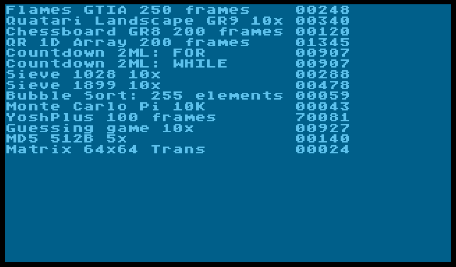

# kickc-benchmarks

A series of benchmarks using [kickc](https://gitlab.com/camelot/kickc) c compiler.

The suite is directly translated from [mad pascal
bench suite](https://github.com/zbyti/a8-mad-pascal-bench-suite).

For the latest binary, load [suite.xex](bin/suite.xex).

## Latest test results:

## Building

There is a Makefile to build the output. If kickc.sh is not on the path, export `KICKC_HOME` first.

	export KICKC_HOME=/path/to/your/kickc-distribution
    make

Makefile will create applications for every c file in the src/ directory.
So if you are including additional library routines without a main, those sources need
to live in lib/ or any <foo>.lib/ directory.

## Emulator notes

Running the emulator through make, you need to set the value `EMURUN` to be the path of
the xex to run, and call the appropriate emulator task (e.g. wine_altirra):

    # set the env var ALTIRRA_HOME
    ALTIRRA_HOME=/path/to/your/Altirra-3.90 
    make EMURUN=bin/suite.xex wine_altirra

As I'm using Altirra, the build is geared up to producing files for that.
The `all` task will include generating a `<src name>.atdbg` file (altirra debug) with
symbols converted from the kickc generated `<src name>.vs` which Altirra loads when
it loads the xex file.

The script to make this is very hacky and would be better producing different it from the
`<src name>.dbg` or having kickc natively support altirra debug. Currently, where two variables
share the same memory location (e.g. ZP varibles) the names conflict, so you often see the wrong
name in altirra. Not sure if this is fixable.

Breakpoints are included too, so adding

    #include <6502.h>
    // ...
    BREAK();

in your source code will cause an appropriate break point in the atirra debug file
at the correct place in your code.

To run the emulator through `make`, only altirra with wine is currently supported
as I'm developing on linux and this is my preferred way of debugging.
More configurations can be add later for e.g. win_altirra, win_atari800.

Windows support is not tested and has mostly been stripped out.

## TODO

1. Floating point implementation and benchmarks
